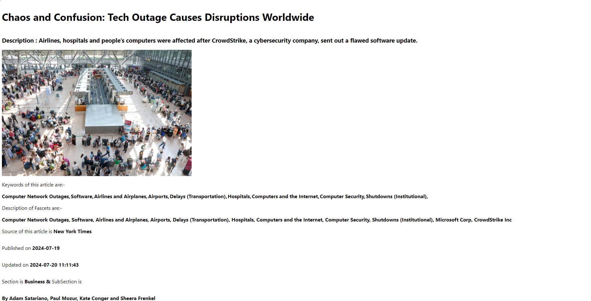
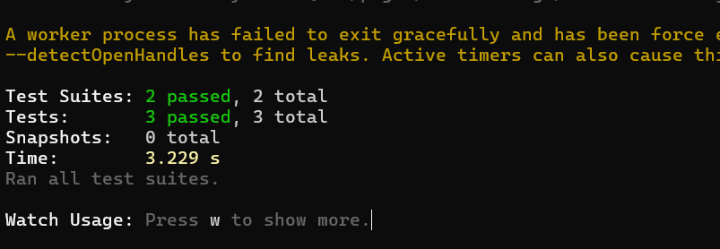

# NY Times Most Popular Articles

This App Contains the Most Popular Articles of NY Times. And In the Web Page user can see those articles and can view the detail article by clicking on it.

Here is the App Looks like

And here are the Test Cases Result

## Available Scripts

In the project directory, you can run:

### `npm start`

Runs the app in the development mode.\

Open [http://localhost:3000](http://localhost:3000) to view it in your browser.

The page will reload when you make changes.\

You may also see any lint errors in the console.

### `npm test`

Launches the test runner in the interactive watch mode.\

See the section about [running tests](https://facebook.github.io/create-react-app/docs/running-tests) for more information.

### `npm test file-name`

If we want to run a specific test case based on file name, we can run this script.

### `npm run build`

Builds the app for production to the `build` folder.\

It correctly bundles React in production mode and optimizes the build for the best performance.

The build is minified and the filenames include the hashes.\

Your app is ready to be deployed!

See the section about [deployment](https://facebook.github.io/create-react-app/docs/deployment) for more information.
